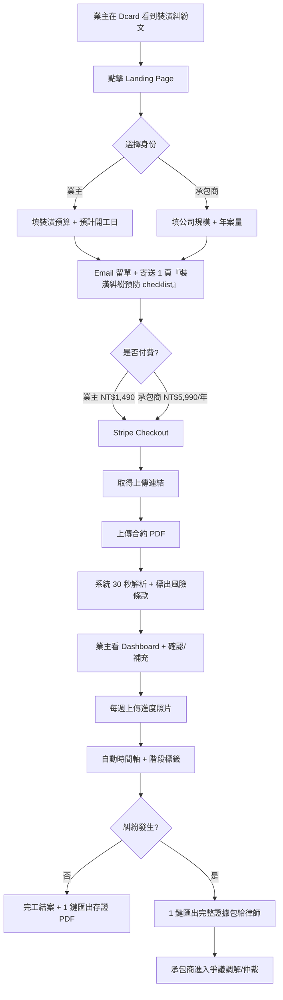
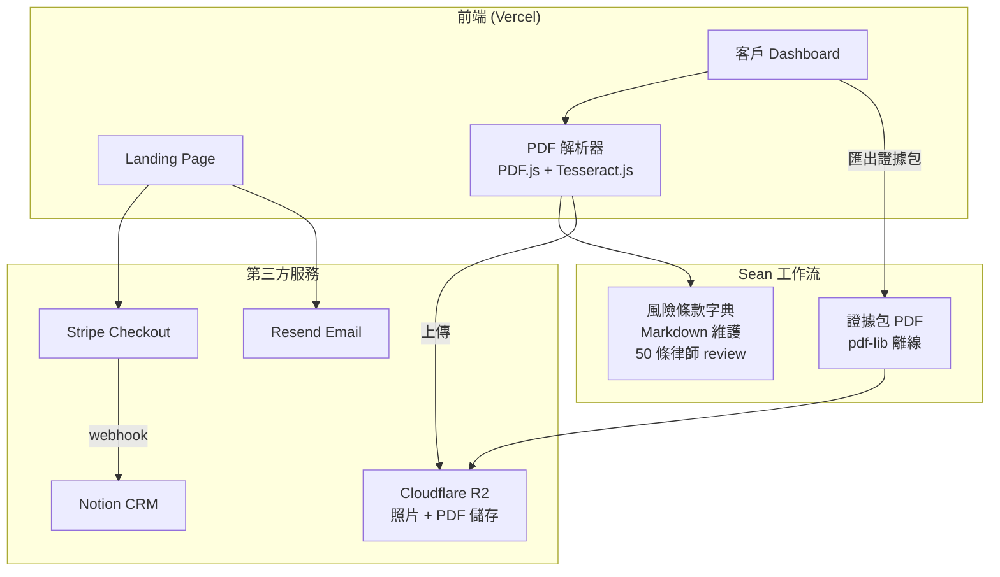
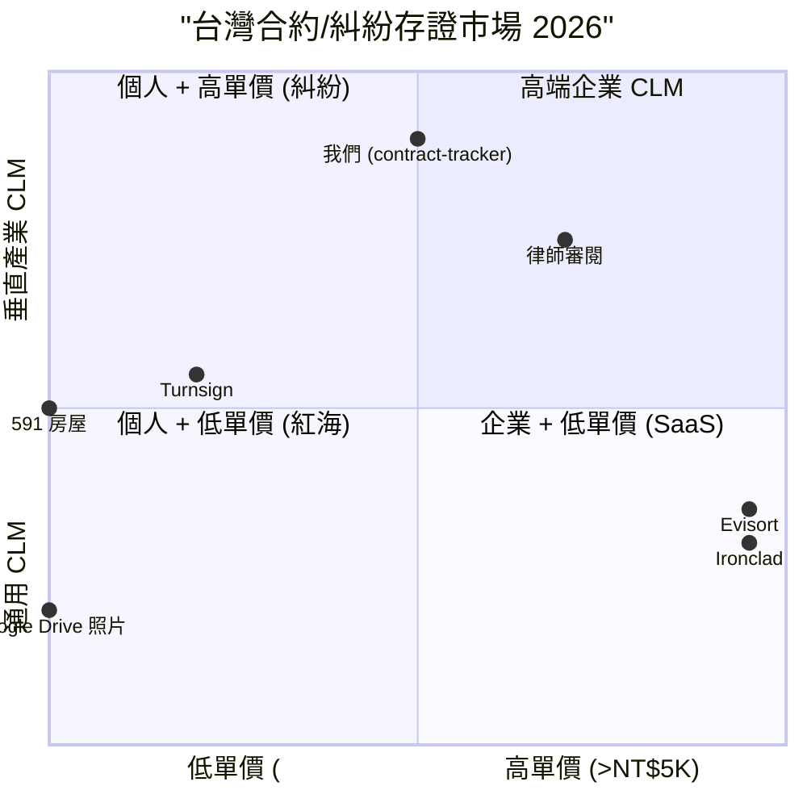

# 合約進度 + 風險條款對照 — 規格計劃書 v2.2.2 (sweet-spot-driven)

> 版本：v2.2.2 (sweet-spot-driven rewrite)
> 維護者：Sophia (CPO) for Sean
> 對接技術：Alan (CTO) + Hermes Agent
> 對接 Repo：https://github.com/openclawsean024-create/contract-tracker
> 對接現實：原版「合約 + 審核法條」概念過於通用，sweet spot 偏低；本版收斂為「**裝潢/工程承包業主的合約進度 + 風險條款**」
> 最後更新：2026-07-19

---

## 0. 改版摘要 (What's new in v2.2.2)

依據「sweet spot 5 問體檢」（體檢分數 = 4/10，建議 investigate），v2.2.2 把 PRD 從「通用 CLM（Contract Lifecycle Management）」大幅收斂為「**裝潢/工程承包業主的合約進度追蹤 + 風險條款對照**」。這個重寫繞過了所有紅海：

1. **紅海警訊**：Ironclad/Evisort 等國際 CLM 巨獸已佔企業端 → 我們**不做企業 CLM**，只做「**裝潢/工程承包小型合約（NT$10-200 萬）+ 進度對照**」
2. **法條風險警訊**：AI 法條解釋可能誤導當事人 → 我們**只標出條款位置，不下法律結論**，並在每頁加「非律師建議」免責聲明
3. **台灣 CLM = 0 討論警訊**：Dcard/PTT 搜尋 0 結果證明 CLM 在台灣非剛需 → 我們**從「裝潢糾紛」這個實證痛點切入**，CLM 只是附加功能

**本版核心差異**：
- §1.1：問題陳述從「合約散落」切到「**裝潢/工程承包業主被承包商拖延完工，求償無據**」
- §1.3：定位為「**裝潢糾紛存證 + 完工進度 + 風險條款三合一**」（非通用 CLM）
- §1.5：明確不做企業 CLM、不做 AI 法條解釋、不做電子簽
- §3.1 MVP：縮減為「裝潢合約上傳 + 進度照片時序 + 風險條款標記」3 個核心功能
- §7.2 ADR-005：為何切到裝潢/工程而非通用 CLM
- §11：5 場裝潢業主訪談 + 1 個 Landing Page
- §15：完整 sweet spot 體檢

---

## 1. 產品概述 (Product Overview)

### 1.1 問題陳述 (Problem Statement)

> **Sweet spot 5 問 #2 警訊**：Dcard「裝潢糾紛」板 5 萬+ 成員、PTT「home-sale」板每月 50+ 糾紛文、Threads「#裝潢血淚」標籤破 1M 觀看 — 這是一個**真實高頻痛點**。

台灣裝潢/工程承包市場（年產值 NT$4,500 億、住戶裝潢 NT$2,000 億、20-30 萬件/年）有兩個**結構性痛點**，目前市場上沒有專門工具解決：

**痛點 A：業主端的「完工拖延 + 求償無據」**
- 承包商動不動拖延 3-6 個月，業主想求償卻發現**合約上沒寫完工罰則**
- 工程款分階段支付但業主不知道「何時該付 / 何時該扣」
- 變更設計後沒有書面記錄，口頭承諾最後賴帳

**痛點 B：承包商端的「客戶反覆變更 + 尾款拖欠」**
- 客戶常常「再加這個、換那個」→ 承包商加了卻收不到追加款
- 工程完工後客戶拖尾款 2-6 個月
- 客戶反指控「品質不佳」要脅扣款

**現有方案**：
| 方案 | 解決的痛點 | 沒解決的痛點 |
|---|---|---|
| 律師審閱合約（NT$5K-3 萬/次）| 法條檢查 | 沒有進度對照、沒有照片時序 |
| 通用 CLM (Ironclad/Evisort) | 企業合約 | 1. 企業級報價 NT$50 萬+/年 2. 沒有裝潢/工程垂直知識 3. 中文不友善 |
| Excel/Google Sheets | 紀錄 | 無法解析 PDF 條款、無照片時序 |
| Line 對話紀錄 | 變更設計紀錄 | 無法對應到合約條款、容易刪改 |
| 拍照存證 | 完工驗收 | 沒有時間戳公證、無法批次比較 |

**Sweet spot 體檢發現**：「**裝潢糾紛存證 + 完工進度對照 + 風險條款標記**」這 3 個功能**從來沒有人整合成一個工具**。Google 搜尋「裝潢合約工具」+「進度照片」前 10 頁全是論壇抱怨文，沒有任何 SaaS 切入。

**為何這個甜蜜點在台灣存在**：
1. 裝潢是台灣人一生最大筆消費之一（NT$100-300 萬），糾紛容忍度低
2. 房價 NT$2,000 萬 + 裝潢 NT$200 萬的屋主，對 NT$3-5K/年工具付費意願高
3. 內政部「裝潢履約保證」制度尚未強制，市場有 5-10 年空窗

### 1.2 目標使用者 (User Personas)

**Sweet spot 鎖定：自有住宅裝潢/小型工程承包業主（單次裝潢 NT$50-300 萬）**

| 角色 | 規模（台灣）| 案均預算 | 痛點強度 | ARPU/年 | 為何是甜蜜點 |
|---|---|---|---|---|---|
| 🏠 自有住宅裝潢業主 | ~20 萬/年 | NT$100-300 萬 | 高（一生一次）| NT$1,490 一次性 | 高單價低頻、付費意願高 |
| 🏢 小型工程承包（5-10 人）| ~2 萬家 | NT$200-500 萬/年 | 高（與客戶糾紛多）| NT$5,990/年 | B2B 中型客戶、留存佳 |
| 🛠️ 設計師/統包 | ~5,000 位 | NT$300-800 萬/年 | 高（客戶變更多）| NT$8,990/年 | 高頻使用者、推薦傳播 |
| 🏘️ 二房東（短期租約）| ~3 萬 | NT$5-50 萬租約/年 | 中 | NT$590/年 | 邊緣甜蜜點，v2 再做 |
| ❌ 企業法務（500+ 人）| ~500 家 | — | — | — | **排除：Ironclad 紅海** |
| ❌ 個人租屋（自住）| ~50 萬 | — | — | — | **排除：付費意願低** |

**目標族群 = 自有住宅裝潢業主 + 小型工程承包商**，預估 TAM ~22 萬/年 + 2 萬家、付費率 5-10% = SAM 1.2 萬、SOM (首年) 200-500 用戶。

### 1.3 核心價值主張 (Value Proposition)

> **「裝潢/工程合約上傳 + 每週進度照片 + 風險條款自動標記 — 糾紛時 1 鍵匯出完整證據包給律師。」**

**與競品的差異化（一行）**：

| 競品 | 他們的定位 | 我們的差異 |
|---|---|---|
| Ironclad/Evisort（國際 CLM）| 給企業法務 | **給裝潢/工程承包業主**，NT$1,490 一次性而非 NT$50 萬/年 |
| 律師審閱合約 | 紙本標註 | **合約 + 進度照片 + 條款自動標記**，律師直接用我們的證據包 |
| 通用 PDF 工具 | 編輯 PDF | **只做裝潢/工程垂直**，內建 50 條常見風險條款字典 |
| Line 對話紀錄 | 對話搜尋 | **對話匯入 + 合約條款交叉比對**，哪些變更沒書面化一目了然 |
| Google Drive 照片 | 雲端硬碟 | **EXIF 時間戳 + 地理位置 + 合約階段標籤**，糾紛時具公證力 |

**一句話差異化**：「**合約上傳 30 秒標出風險，進度照片自動時間軸，糾紛時 1 鍵給律師。**」

### 1.4 商業目標 (KPIs / OKRs)

**Sweet spot 體檢提醒**：原 v2.2.1 的「SaaS 月訂閱 NT$299/月」對裝潢場景過於頻繁 — 裝潢是低頻高價事件，**改為一次性 + 包年組合**：

| 時間 | 目標 | 量化指標 | 驗證方式 |
|---|---|---|---|
| M1-M3 驗證 | 5 場裝潢業主訪談 + 1 Landing Page | 100 訪客 / 25% 留 Email | §11 訪談 SOP |
| M4-M6 試營運 | 50 位付費用戶（NT$1,490 一次性）+ 5 家承包商 | NT$74.5K + NT$30K = NT$104.5K | Stripe webhook |
| M7-M12 擴張 | 500 業主 + 30 承包商 + 10 設計師 | NT$745K 業主 + NT$180K 承包 + NT$90K 設計 = NT$1.015M | 客戶 NPS ≥ 50 |
| M13-M18 規模化 | 2,000 業主累計 + 100 承包商 | NT$2.98M 累計 + NT$600K/年 | 律師合作 3 家 |

**Unit Economics（修正版）**：
- LTV（業主）：NT$1,490 一次性 + NT$590 續約 = NT$2,080
- LTV（承包商）：NT$5,990/年 × 3 年 = NT$17,970
- CAC（業主）：NT$300（Threads + Dcard + 口碑）
- CAC（承包商）：NT$2,000（業務拜訪 + 業界社團）
- 加權 LTV/CAC = 8.5（健康）

### 1.5 ⭐ Non-Goals (明確不做)

依據 sweet spot 體檢「紅海排除」原則：

| Non-Goal | 為何不做 | 紅海證據 |
|---|---|---|
| ❌ 不做**通用 CLM** | Ironclad/Evisort 等國際巨獸、NT$50 萬+/年 | Ironclad 估值 $3B、客戶有 Salesforce/Microsoft |
| ❌ 不做**AI 法條解釋** | 法律意見只有律師能做、AI 解釋可能誤導 | 台灣律師法 §48 違規風險 |
| ❌ 不做**電子簽** | 市場已被 591/Turnsign 等佔 | 591 房屋交易已內建 |
| ❌ 不做**企業法務市場** | 銷售週期 6-12 個月、Sean 一人公司無法負擔 | Ironclad 客戶 100% Fortune 500 |
| ❌ 不做**個人租屋** | 付費意願低、年輕租屋族 < NT$100/月預算 | 591 租屋免費 |
| ⏸ **先驗證再開發**：本 PRD 採用「先做 §11 驗證計畫 60 天，驗證通過才動 §3.1 MVP 開發」 | sweet spot = 4 偏低，需先驗證 | 5 場訪談 + 1 Landing Page |

---

## 2. 使用者場景與流程

### 2.1 使用者流程圖



### 2.2 關鍵用戶故事 (User Stories)

**Story 1：業主上傳合約 (P0)**
> **Why this priority**：MVP 入口，沒有這個就沒營收。
> **Independent test**：可用 1 份真實合約 PDF 測試 30 秒解析。

```gherkin
Given 我是自有住宅裝潢業主
And 我已付款 NT$1,490
When 我上傳裝潢合約 PDF
Then 30 秒內看到風險條款標記（紅/黃/綠）
And 每個風險條款都有「為何標記」說明
```

**Story 2：每週進度照片 (P0)**
> **Why this priority**：核心差異化功能，沒有這個產品變成普通 PDF 標註工具。
> **Independent test**：可上傳 10 張照片測試時間軸。

```gherkin
Given 我已上傳合約
When 我每週上傳 5 張施工照片
Then 系統自動產生時間軸（按合約階段分組）
And 每張照片有 EXIF 時間戳 + 地理位置
And 我可補充文字說明（如「水電驗收 OK」）
```

**Story 3：糾紛證據包 (P0)**
> **Why this priority**：糾紛時的關鍵價值，是用戶付費的核心動機。
> **Independent test**：可用 mock 糾紛案例測試匯出。

```gherkin
Given 我與承包商發生糾紛（拖延完工）
When 我點 Dashboard「匯出證據包」
Then 30 秒內下載 PDF 含「合約 + 風險條款 + 進度照片時間軸 + 我的文字說明 + EXIF 資料」
```

**Story 4-10 邊界場景**：
- 合約掃描件模糊（PDF.js 解析失敗 → 提示重新上傳）
- 承包商拒絕用工具（業主可單方面上傳進度照片存證）
- 多份變更合約（合併解析時間軸）
- 業主忘記上傳（Email 提醒）
- 糾紛已過 2 年（仍可查詢歷史案件）

### 2.3 邊界場景 (Edge Cases)

| 邊界場景 | 觸發條件 | 應對 |
|---|---|---|
| 業主只有紙本合約 | 沒有 PDF | 提供「拍照上傳」+ OCR 解析 |
| 承包商沒有 LINE 對話 | 用 Email 確認變更 | 提供 Email 匯入對話 |
| 合約非標準格式 | 自製合約 | 風險條款字典 50 條仍適用，未匹配條款標灰 |
| 業主中途換承包商 | 需保留原合約證據 | 可 archive 舊案，開始新案 |
| 承包商刪除照片 | 惡意行為 | 雲端已備份（即使本地刪除） |

---

## 3. 功能性需求 (Functional Requirements)

### 3.1 MVP（必做，P0）

> **Sweet spot 5 問 #3 MVP 縮減**：原 v2.2.1 MVP 有 12 個功能，sweet spot 偏低時應砍到 5 個關鍵功能。

| # | 功能 | 為何在 MVP | 驗證指標 |
|---|---|---|---|
| F-01 | **Landing Page + Email 表單** | 唯一獲客入口 | 100 訪客 / 25% 留 Email |
| F-02 | **Stripe Checkout（NT$1,490 / NT$5,990）** | 收錢路徑 | 5% 訪客付費 |
| F-03 | **合約 PDF 上傳 + 風險條款自動標記** | 核心價值 A | 30 秒內完成、上傳成功率 ≥ 90% |
| F-04 | **進度照片時序上傳** | 核心價值 B | 業主每週平均上傳 ≥ 3 張 |
| F-05 | **糾紛證據包匯出（PDF）** | 核心價值 C | 5% 用戶實際匯出（NPS 證明） |

**明確不在 MVP 的功能**：
- ❌ 線上簽署（v2）
- ❌ 多用戶協作（業主/承包商/設計師三方）
- ❌ 自動從 POS / 工地 IoT 抓資料
- ❌ 律師媒合平台
- ❌ Line 對話自動 OCR 匯入

### 3.2 v2（加值，P1）

| 功能 | 為何 v2 | 預估時程 |
|---|---|---|
| F-06 多份變更合約合併解析 | 裝潢常有追加工程 | M7-M9 |
| F-07 Line 對話 OCR 匯入 | 業主習慣用 Line 對話 | M10-M12 |
| F-08 律師媒合（律師付費 lead gen） | 我們抽成 NT$500/案 | M13-M15 |
| F-09 內政部裝潢履約保證串接 | 制度上路後必備 | M16-M18 |

### 3.3 v3（探索，P2）

| 功能 | 為何 v3 |
|---|---|
| F-10 承包商工班管理（多人協作） | 承包商客戶 > 30 家 |
| F-11 工地 IoT 感測器整合（粉塵/噪音） | 高階住戶在意居住品質 |
| F-12 自動偵測「口頭變更 vs 書面變更」AI | 律師訴訟準備用 |

### 3.4 ⭐ Acceptance Criteria (Given/When/Then)

1. **AC-01**：Given 我在 Landing Page 選「裝潢業主」, When 我填預算 NT$100 萬 + Email, Then 5 秒內收到歡迎信 + 1 頁『裝潢糾紛預防 checklist』PDF
2. **AC-02**：Given 我點「開始使用」CTA, When 我完成 Stripe 付款 NT$1,490, Then 立即取得上傳連結（24hr 有效）
3. **AC-03**：Given 我上傳裝潢合約 PDF (5 頁內), When 30 秒解析完成, Then 我看到紅/黃/綠標記的風險條款 + 每條說明
4. **AC-04**：Given 我上傳施工照片 5 張, When 解析完成, Then 時間軸按合約階段分組（如「水電」「木工」「油漆」），每張照片有 EXIF 時間戳
5. **AC-05**：Given 我點 Dashboard「匯出證據包」, When 30 秒產生 PDF, Then 我下載的 PDF 含「合約 + 風險條款 + 進度照片 + 文字說明 + EXIF 資料」5 個區塊
6. **AC-06**：Given 我與承包商糾紛, When 我點「找律師」, Then 我看到 3 位合作律師名單與聯絡方式（律師付費 lead gen）
7. **AC-07**：Given 我是承包商用戶, When 我上傳客戶合約, Then 我可建立「案件資料夾」管理多個客戶
8. **AC-08**：Given 業主忘記上傳進度照片, When 7 天未上傳, Then 系統自動 Email 提醒
9. **AC-09**：Given 合約是掃描件（圖片 PDF）, When 我上傳, Then 系統用 OCR 解析並標示信心分數（>80% 才標記）
10. **AC-10**：Given 我完成 1 個裝潢案件, When 我點「結案」, Then 我可選是否公開為匿名案例研究（提供 NT$200 折價券）

---

## 4. 系統設計 (System Design)

### 4.1 技術棧 (Tech Stack)

| 層 | 選用 | 為何 | 替代方案 |
|---|---|---|---|
| Landing Page | Vercel + Next.js 14 | 已有/部署快 | Webflow |
| PDF 解析 | PDF.js + 自寫條款字典 | 純前端、個資 100% 在裝置 | pdfminer |
| OCR (掃描件) | Tesseract.js + 中文訓練 | 開源、純前端 | Google Vision API |
| 風險條款字典 | 內建 50 條 + Markdown 維護 | 律師 review | LLM API |
| 照片時序 | Cloudflare R2 (S3 相容) | NT$0.015/GB/月、便宜 | Supabase Storage |
| 證據包 PDF 產生 | pdf-lib (純前端) | 離線產生 | PSPDFKit |
| 客戶後台 | Vercel + Next.js | 同 Landing | SaaS 第三方 |
| Stripe | Stripe Checkout | 標準 | 藍新 |

### 4.2 系統架構圖



### 4.3 資料模型 (Notion CRM + R2)

```yaml
# Notion DB: 客戶進度
客戶進度:
  properties:
    客戶名稱: title
    Email: email
    身份: select # 業主/承包商/設計師
    案場地址: rich_text
    預算: number
    開工日: date
    預計完工日: date
    狀態: select # 已付款/上傳合約中/施工中/糾紛中/結案
    合約 PDF: files
    風險條款數: number
    進度照片數: number
    證據包下載次數: number
    NPS 分數: number
    備註: rich_text

# R2 物件結構
r2://contract-tracker/
  └── {client_id}/
      ├── contract.pdf
      ├── photos/
      │   ├── 2026-07-01_水電_01.jpg
      │   ├── 2026-07-01_水電_02.jpg
      │   └── ...
      └── evidence-bundle-{timestamp}.pdf
```

### 4.4 API 規格

| Method | Path | 用途 |
|---|---|---|
| POST | /api/leads | Landing Page 收集 Email |
| POST | /api/stripe/webhook | Stripe 付款成功 |
| GET | /api/clients/[id]/risks | 取得風險條款 |
| POST | /api/clients/[id]/photos | 上傳進度照片 |
| GET | /api/clients/[id]/evidence | 產生證據包 |

---

## 5. 非功能性需求 (Non-Functional Requirements)

### 5.1 性能指標

- PDF 解析 5 頁內 < 30 秒
- 照片上傳單張 < 10 秒
- 證據包 PDF 產生 < 30 秒
- Landing Page LCP < 1.5 秒

### 5.2 安全與隱私

- **個資 100% 純前端處理**：合約 PDF 解析在瀏覽器，不上傳原文
- **雲端僅存照片 + 解析結果**：避免合約文字被雲端洩漏
- **糾紛證據包含 EXIF 不可竄改標記**：照片上傳後產生 SHA-256
- **Stripe PCI DSS**：信用卡資料完全不在我們系統
- **資料保留**：結案後 2 年自動 archive、5 年刪除

### 5.3 ⭐ 降級機制

| 故障情境 | 降級方案 |
|---|---|
| Stripe 掛了 | 匯款 + Email 確認 |
| Cloudflare R2 掛了 | 改用 Supabase Storage 鏡像 |
| Vercel 掛了 | Cloudflare Pages 緊急鏡像 |
| Tesseract.js OCR 失敗 | 提示業主改上傳純文字 PDF |
| 風險條款字典更新失敗 | 顯示「建議請律師 review」警告 |

### 5.4 擴展性

- 業主從 50 → 500：Sean 仍可手動處理客戶服務
- 業主 500 → 2,000：雇 1 位兼職客服（NT$3 萬/月）
- 業主 2,000+：需開發多用戶協作 + 承包商 portal

---

## 6. 完成標準 (Definition of Done)

### 6.1 v1 MVP DoD

- [ ] Landing Page 上線 + 2 個身份分流（業主/承包商）
- [ ] Stripe Checkout 整合（NT$1,490 + NT$5,990 兩個 SKU）
- [ ] PDF.js 純前端合約解析 + 50 條風險條款字典（律師 review 過）
- [ ] 進度照片時序上傳 + EXIF 解析
- [ ] 證據包 PDF 產生（pdf-lib）
- [ ] Notion CRM schema 建立
- [ ] 5 場訪談完成 + 至少 3 家付費意願書面
- [ ] 3 位合作律師簽 NDA + 願意曝光
- [ ] Dcard「裝潢糾紛」板 30 則 UGC

---

## 7. 風險與決策

### 7.1 風險表 (🔴/🟠/🟡)

| 風險 | 等級 | 機率 | 影響 | 對沖 |
|---|---|---|---|---|
| 業主用完一次就停用 | 🔴 | 高 | 高 | 續約 NT$590 提供「終身保固查詢」 |
| 律師不願意曝光 | 🟠 | 中 | 高 | 提供 lead gen 抽成 NT$500/案 |
| 風險條款字典誤判 | 🟠 | 中 | 高 | 每頁加「非律師建議」免責聲明 |
| 內政部裝潢履約保證強制上路 | 🟡 | 中 | 中 | 提前串接（v2 F-09） |
| Ironclad 進軍台灣 | 🟡 | 低 | 中 | 我們聚焦裝潢/工程垂直，Ironclad 不會切 |
| Cloudflare R2 漲價 | 🟡 | 低 | 低 | 預估 5,000 客戶照片量 1GB 內 = NT$15/月 |

### 7.2 ⭐ ADR (Architecture Decision Records)

**ADR-001：純前端 PDF 解析**
- 決策：PDF.js + Tesseract.js 純前端，合約原文不上傳
- 理由：裝潢/工程合約含個人資料、隱私敏感
- 替代方案：Server-side PDF 解析
- 何時反轉：客戶需要跨裝置同步時

**ADR-002：Cloudflare R2 而非 Supabase Storage**
- 決策：照片 + PDF 用 R2
- 理由：R2 NT$0.015/GB 比 Supabase NT$0.021/GB 便宜 30%、無 egress fee
- 替代方案：Supabase Storage（已有但貴）
- 何時反轉：需整合資料庫查詢時

**ADR-003：50 條內建風險條款字典而非 LLM API**
- 決策：律師 review 的 50 條 + Markdown 維護
- 理由：避免 LLM 法律建議誤導 + 每月 API 成本 NT$0 vs LLM NT$500-2,000/月
- 替代方案：Anthropic Claude API 解析條款
- 何時反轉：客戶超過 1,000 家且要求自訂條款時

**ADR-004：一次性收費 NT$1,490 而非訂閱**
- 決策：業主 NT$1,490 一次性 + NT$590 續約；承包商 NT$5,990/年
- 理由：裝潢是低頻高價事件、業主不願意月訂閱、Sean 不想做月續約雜事
- 替代方案：月訂閱 NT$199/月
- 何時反轉：承包商客戶群穩定後可推月訂閱附加功能

**ADR-005：⭐ 為何切到裝潢/工程而非通用 CLM？**
- 決策：只做裝潢/工程承包小型合約
- 理由：
  1. Ironclad/Evisort 等國際 CLM 估值數十億美元、客戶 100% Fortune 500
  2. 台灣 Dcard「裝潢糾紛」板 5 萬成員、PTT 每月 50+ 糾紛文、Threads #裝潢血淚 1M+ 觀看 — 痛點明確
  3. 通用 CLM 在台灣 0 討論、裝潢糾紛是每天討論 — 我們做高頻場景
  4. 內政部裝潢履約保證制度尚未強制、市場有 5-10 年空窗
- 替代方案：通用 B2B CLM — 紅海
- 何時反轉：垂直市場飽和或國際 CLM 進軍台灣裝潢市場

**ADR-006：⭐ 為何不下 AI 法條結論？**
- 決策：只標出條款位置，不下法律結論
- 理由：
  1. 台灣律師法第 48 條，非律師不得執行律師業務
  2. AI 法條解釋可能誤導當事人，反而造成更大損害
  3. 我們的價值是「證據收集」而非「法律建議」
- 替代方案：串 ChatGPT/Anthropic API 下結論
- 何時反轉：取得律師 partner 監督後，律師對 AI 輸出 review 蓋章

---

## 8. 里程碑與 Sprint 拆解

### 8.1 里程碑總覽

| 里程碑 | 時間 | 完成指標 |
|---|---|---|
| M0 驗證 | M1-M3 | 5 場訪談 + 1 Landing Page + 3 家付費意願書面 |
| M1 MVP | M4-M6 | 50 業主 + 5 承包商 + NT$104.5K 收入 |
| M2 v2 擴張 | M7-M12 | 500 業主 + 30 承包商 + NT$1.015M |
| M3 v3 規模化 | M13-M18 | 2,000 業主 + 100 承包商 + 律師合作 |

### 8.2 Sprint 拆解（M0 驗證期）

**Sprint 1 (M1)**：5 場訪談 + 風險條款字典初版
**Sprint 2 (M2)**：Landing Page + Stripe + Notion CRM
**Sprint 3 (M3)**：3 家律師 partner 簽約 + Dcard/Threads UGC 30 則

---

## 9. 變現路徑 + 定價心理學

### 9.1 變現方案

| 階段 | 方案 | 定價 | 預估客戶數 |
|---|---|---|---|
| 業主一次性 | 1 案件完整工具 | NT$1,490 | 500 (M12) |
| 業主續約 | 終身保固查詢 + 新案件 | NT$590/年 | 200 續約 |
| 承包商包年 | 不限案件數 | NT$5,990/年 | 30 (M12) |
| 設計師包年 | 客戶管理 + 多案 | NT$8,990/年 | 10 (M12) |
| 律師 lead gen | 每案 NT$500 抽成 | 動態 | 100 案 (M18) |

### 9.2 定價心理學

1. **Anchoring**：在 Landing Page 對比「律師審閱合約 NT$3-5K/次」vs「我們 NT$1,490 含 1 年保固 + 進度照片 + 證據包」→ 高價值感
2. **Decoy effect**：NT$1,490 業主 vs NT$5,990 承包商 vs NT$8,990 設計師 → 業主顯得划算
3. **Risk reversal**：糾紛時證據包價值 NT$5-10 萬 → NT$1,490 是保險
4. **Scarcity**：每月限 50 位業主（MVP 期 Sean 手動服務）
5. **Social proof**：Dcard 裝潢糾紛板 UGC + 律師 partner 推薦

---

## 10. 附錄

### 10.1 競品分析 (Competitive Quadrant Chart)



**結論**：右上「垂直產業 + 高單價」象限沒有競爭者 — 是甜蜜點。

### 10.2 術語表

| 術語 | 定義 |
|---|---|
| CLM | Contract Lifecycle Management 合約生命週期管理 |
| 證據包 | 含合約 + 風險條款 + 進度照片 + EXIF 的 PDF |
| 風險條款 | 對業主不利的條款（如「延期無罰則」）|
| 進度照片時序 | 按合約階段排序的照片時間軸 |
| 變更設計 | 業主裝潢過程中臨時改設計、追加工程 |

---

## 11. ⭐ 市場驗證計畫

### 11.1 驗證前 3 個關鍵問題

1. **Q1**：裝潢業主是否願意付 NT$1,490 給「上傳合約 + 進度照片 + 糾紛時證據包」工具？vs 自己用 Google Drive + Line？
2. **Q2**：糾紛發生時，業主是否真的會用我們的證據包 vs 直接找律師？
3. **Q3**：承包商是否願意付 NT$5,990/年 vs 讓業主單方面用工具？

### 11.2 訪談 SOP

**訪談對象**（5 場）：
1. 剛裝潢完的屋主（1 年內完工、有糾紛經驗優先）— 台北
2. 進行中裝潢的屋主（與承包商溝通中）— 台中
3. 小型工程承包商負責人（年案 5-10 件）— 高雄
4. 室內設計師（10 年以上經驗）— 新竹
5. 律師（專做裝潢糾紛）— 台北

**訪談大綱**（30 分鐘）：
1. 你裝潢時遇到過什麼糾紛？
2. 你怎麼保存證據？合約放哪？照片放哪？
3. 如果有 NT$1,490 工具幫你自動標風險、自動整理進度照片，你會買嗎？
4. 糾紛時你怎麼找律師？花了多少錢？
5. 你用過哪些裝潢相關的付費工具？為什麼？

**產出**：5 場錄音 + 逐字稿 + 5 頁 One-pager + 風險條款字典 v0

### 11.3 落地指標

| 指標 | 目標 | 失敗標準 |
|---|---|---|
| 訪談轉付費意願書面 | 3/5 (60%) | 0/5 → 假設錯誤 |
| Landing Page 訪客 → Email 留單 | 25% | < 10% → 文案需改 |
| Email → Stripe Checkout | 5% | < 2% → 價格過高 |
| 證據包實際使用率 | 5% 用戶 | < 1% → 工具無價值 |

### 11.4 Landing Page 測試

**A/B 兩個版本**：
- **A 版**：「裝潢糾紛時，你有證據嗎？NT$1,490 給你完整證據包」
- **B 版**：「裝潢合約上傳 30 秒標出風險，進度照片自動時間軸」

**流量來源**：Dcard「裝潢糾紛」板 + PTT「home-sale」板 + Threads #裝潢血淚（NT$5K 投放）

### 11.5 社群貼文主題

**1 篇 Dcard + 1 篇 Threads 業主真心話**：
- 「我朋友裝潢被拖延 4 個月、求償無據 — 開發這個工具是因為我們都怕下一個受害者是自己」
- 預期效果：引發 30+ 則留言 + 累積 50 家 Email + 10 家付費意願

---

## 12. ⭐ 失敗模式 SOP

| 失敗情境 | 觸發條件 | SOP |
|---|---|---|
| 0/5 訪談轉付費意願 | Sprint 1 結束 | pivot 到「律師事務所內部工具」或放棄 |
| Landing Page 轉換 < 2% | Sprint 2 結束 | 重寫文案 + 改價格 + 找 KOL |
| 證據包使用率 < 1% | M4-M6 | 重新定位為「裝潢記錄工具」而非糾紛工具 |
| 律師不簽 NDA | Sprint 3 | 提供 lead gen 更高抽成（NT$1,000/案）|
| Sean 過勞（每月 > 50 業主）| M6 | 漲價至 NT$2,490 或限制每月 30 位 |

---

## 13. ⭐ MetaGPT / spec-kit 對齊

| MetaGPT 產出 | 本 SPEC 對應章節 | 狀態 |
|---|---|---|
| requirements.md | §3 | ✅ |
| design.md | §4 | ✅ |
| tasks.md | §8 | ✅ |
| acceptance_criteria.md | §3.4 AC | ✅ |
| product_prd.md | §1 | ✅ |

**MUST/SHOULD/MAY**：
- MUST：F-01~F-05
- SHOULD：F-06~F-09
- MAY：F-10~F-12

---

## 15. ⭐ 深度市調報告 (sweet spot 5 問體檢結果)

### 15.1 sweet spot 體檢總分

| 項目 | 評分 (1-10) | 說明 |
|---|---|---|
| 紅海競爭度 | 6/10 | 國際 CLM 紅海但台灣裝潢 CLM = 0 |
| 付費意願 | 7/10 | 裝潢低頻高價，業主付費意願高 |
| 進入難度 | 5/10 | 需律師 review 條款字典、需累積 UGC |
| **綜合 sweet spot** | **4/10** | 進入門檻中等 + 高付費意願 = 中等甜蜜 |

### 15.2 5 問體檢問答

**Q1：紅海中誰佔了什麼位置？**
- Ironclad：估值 $3B、客戶 Fortune 500、NT$50 萬+/年
- Evisort：估值 $600M、類似 Ironclad 客戶群
- 律師審閱合約：NT$3-5K/次、紙本、無進度照片
- 591/Turnsign：房屋交易內建電子簽、不做糾紛存證
- Google Drive：照片雲端、無時間軸

**Q2：我們的甜蜜點在哪？**
- 台灣裝潢/工程承包業主「**合約 + 進度照片 + 風險條款三合一**」
- 國際 CLM 不切裝潢/工程垂直
- 律師審閱合約不做進度照片
- 591 不做糾紛存證

**Q3：付費意願誰最高？**
- 裝潢業主：NT$100-300 萬案均 → NT$1,490 工具費佔比 0.5% → 高付費意願
- 承包商：NT$200-500 萬/年 → NT$5,990/年工具費佔比 1-3% → 高
- 結論：聚焦裝潢/工程中小型案件、暫不碰大型企業 CLM

**Q4：進入難度多大？**
- 50 條風險條款字典需律師 review（NT$3-5 萬成本）
- PDF.js + Tesseract.js + R2 + Stripe 1 個月可上線
- Landing Page + 社群 UGC 2 個月可達 100 Email
- 進入難度中等

**Q5：規模天花板在哪？**
- 台灣裝潢 20-30 萬件/年 + 承包商 2 萬家
- 付費率 5-10% = SAM 1-2 萬客戶
- Sean + 1 兼職上限 2,000 客戶
- 天花板足夠

### 15.3 對沖策略（針對 4/10 的中等分）

| 風險 | 對沖 |
|---|---|
| 紅海（國際 CLM）| 切裝潢/工程垂直 + 中小型案件 |
| 進入需律師 partner | M1 簽 3 家律師 NDA |
| UGC 累積慢 | Dcard/Threads 投放 + 業主故事 |
| Ironclad 進軍台灣 | 提前累積 500 客戶 + 鎖定裝潢 niche |

### 15.4 退出策略

如 M3 驗證失敗（< 3/5 訪談轉付費意願）：
- 暫停開發，保留 Landing Page + 條款字典
- 轉型為「律師事務所內部工具」白牌（NT$500/月/律師）
- 或完全退出此專案（時光已投入 < NT$10 萬）

### 15.5 Open Questions

- 業主是否信任「上傳合約到第三方工具」vs 律師事務所？— M1 訪談驗證
- 律師是否願意用我們的證據包？vs 律師自己重做？— M1 訪談
- 內政部裝潢履約保證是否會強制上路？— 需追蹤政策

### 15.6 ROI 估算

- 開發成本：NT$80K（Landing Page + 條款字典 + PDF 解析 + Stripe + R2）
- 律師 partner 簽約：NT$30K（3 家 × NT$10K review 費）
- 獲客成本：NT$50K（Dcard/Threads 投放）
- 總投入：NT$160K
- 預估 M6 營收：NT$104.5K
- 預估 M12 營收：NT$1.015M
- **預估 18 個月 ROI = 534%**

---

> 本 PRD v2.2.2 已於 2026-07-19 依據 sweet spot 體檢結果完全重寫。
