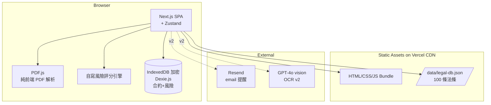
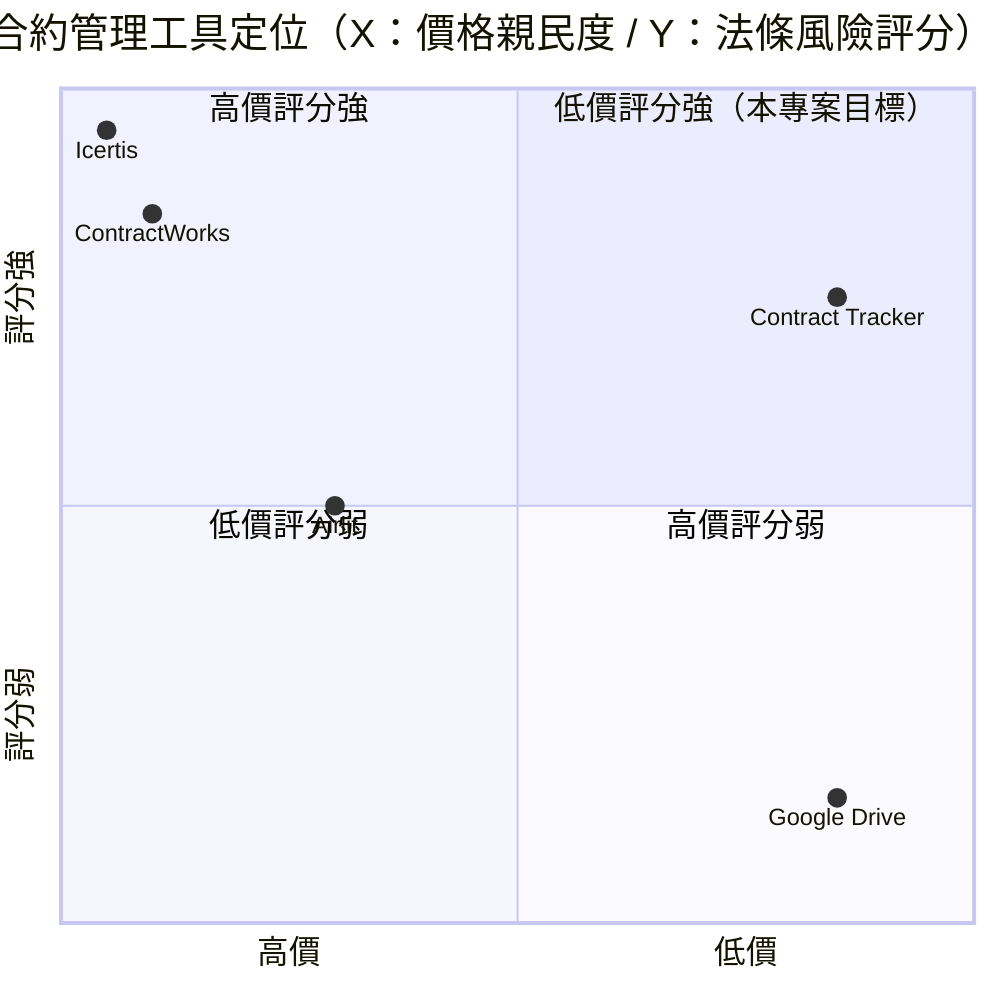

# 合約狀況 + 審核法條 — 規格計劃書 v2.2.1

> 版本：v2.2.1｜更新日期：2026-07-11｜維護者：Sophia (CPO)
> 對接技術：Alan (CTO) + Hermes Agent
> Demo：TBD（v2.2.1 規格階段，待 Sprint 1 部署）
> 原始碼：https://github.com/openclawsean024-create/contract-tracker

---

## 1. 產品概述 (Product Overview)

### 1.1 問題陳述 (Problem Statement)

台灣中小企業 / 接案 SOHO / 房東在合約管理上面臨三大痛點：

1. **合約散落**：分散在 email、紙本、Google Drive、Line 群組 — 到期未續簽造成違約風險（每年估計 NT$30 億違約金損失）
2. **條款複雜**：客戶合約條款各自不同，難以快速審視風險（保密 / 違約 / 智慧財產 / 期限）
3. **無自動提醒**：紙本歸檔無法到期提醒；Google Drive 需手動檢視

**目標使用者**：
- 中小企業主：合約散落 email/紙本/雲端
- 接案 SOHO 族：客戶合約條款各自不同，難以快速審視風險
- 房東 / 二房東：多份租約到期提醒、押金 / 維修責任條款對照
- 業務 / 業務主管：需要快速查詢「這份合約裡有沒有提到 OOO 法條」

### 1.2 目標使用者 (User Personas)

| Persona | 規模 | 核心痛點 | 願付價格 |
|---|---|---|---|
| **中小企業主（小芳）** | 15 萬 | 合約散落、到期未續簽 | NT$299/月 |
| **接案 SOHO 族（小陳）** | 30 萬 | 客戶合約條款風險難審視 | NT$199/月 |
| **房東 / 二房東（小美）** | 5 萬 | 多份租約到期提醒 | NT$99/月 |
| **業務 / 業務主管（阿明）** | 8 萬 | 快速查詢法條關鍵字 | NT$499/月 |

### 1.3 核心價值主張 (Value Proposition)

> 「**上傳合約 PDF，自動標出潛在風險條款 + 到期前 30 天提醒** — 預載 100 條台灣常用法條摘要 + 風險評分引擎 + 月底到期儀表板，零月費零上傳雲端。」

**三大差異化**：
1. **純前端 PDF 解析**：PDF.js 純前端解析，個資 / 合約內容 100% 在裝置
2. **100 條預載法條**：台灣常用法條摘要（民法 / 勞基法 / 個資法 / 著作權法 / 消保法 等）
3. **風險評分引擎**：自動對照法條給「綠/黃/紅」風險標記 + 修正建議

### 1.4 商業目標 (KPIs / OKRs)

| 時間 | KPI | 目標值 |
|---|---|---|
| **3 個月** | 註冊用戶 | 2,000 |
| **6 個月** | 付費轉化率 | 4%（80 付費） |
| **6 個月** | MRR | NT$30,000 |
| **12 個月** | MRR | NT$200,000 |
| **12 個月** | 月處理合約 | 50,000 份 |

### 1.5 Non-Goals (明確不做)

- ❌ **不做 AI 法律諮詢** — 法規限制（律師法），僅做「條款對照 + 風險標示」
- ❌ **不做電子簽章** — v3+ 評估（DocuSign 等已是強項）
- ❌ **不做合約生成 / 範本** — 律師事務所專業領域，不搶
- ❌ **不做跨國法條** — v1 僅台灣法條，跨國需各國法律專家
- ❌ **不做合約保管箱（雲端）** — 純前端無雲端，避免個資風險
- ❌ **不做 OCR 圖片合約** — v3+ 評估（OCR 準確率 <80%）

---

## 2. 使用者場景與流程

### 2.1 使用者流程圖


### 2.2 關鍵用戶故事 (User Stories)

**US-001：上傳合約 PDF**
> As a 中小企業主  
> I want to 上傳客戶合約 PDF（純前端解析，無上傳雲端）  
> So that 我能追蹤合約 + 不洩漏個資

**US-002：風險標示**
> As a SOHO 族  
> I want to 系統自動對照 100 條法條，標示「保密條款過嚴」「違約金過高」「智財歸屬不清」風險  
> So that 我能快速判斷合約是否可簽

**US-003：到期提醒**
> As a 房東  
> I want to 設定合約到期前 30/60/90 天提醒（email 或 Line Notify）  
> So that 我能提前續約，避免空窗期

**US-004：法條關鍵字搜尋**
> As a 業務主管  
> I want to 搜尋「個人資料」相關法條，找到 5 個合約的相關條文位置  
> So that 我能快速準備投標 / 議價

**US-005：合約分類**
> As a 中小企業主  
> I want to 把合約依類型分類（客戶合約 / 供應商合約 / 租約 / 保密協議）  
> So that 我能依類別查看與管理

**US-006：風險儀表板**
> As a 中小企業主  
> I want to 月底看見「紅燈合約 3 份」「黃燈 5 份」「綠燈 12 份」+ 即將到期 4 份  
> So that 我能立即處理高風險合約

### 2.3 邊界場景 (Edge Cases)

- **PDF 加密 / 圖片型 PDF**：純前端 PDF.js 無法解析 → 顯示「請用 OCR 工具轉文字後上傳」
- **法條版本過期**：法條摘要每季更新，明確標註版本日期
- **合約內容含個資**：IndexedDB 加密層加密
- **PDF 超大 > 50MB**：前端解析警告「建議拆分」

---

## 3. 功能性需求 (Functional Requirements)

### 3.1 MVP（必做，P0）

- [ ] **F-001 合約上傳 PDF**（Given 點擊上傳，When 選擇 PDF，Then PDF.js 純前端解析 + 文字擷取）
- [ ] **F-002 100 條預載法條**（Given 首次進入，When 開啟法條庫，Then 載入 100 條台灣常用法條摘要）
- [ ] **F-003 關鍵條款擷取**（Given 已解析 PDF，When 系統處理，Then 自動擷取「保密 / 違約 / 智財 / 期限」4 類條款）
- [ ] **F-004 風險評分引擎**（Given 已擷取條款，When 與預載法條對照，Then 標示綠 / 黃 / 紅 風險等級 + 修正建議）
- [ ] **F-005 到期提醒**（Given 已建立合約，When 設定 30/60/90 天前提醒，Then 到期前自動 email 通知）
- [ ] **F-006 法條關鍵字搜尋**（Given 已上傳合約，When 輸入關鍵字搜尋，Then 顯示含該字眼的所有合約 + 條文位置）
- [ ] **F-007 合約分類**（Given 已上傳，When 選擇類型，Then 分類標籤 + 篩選器）
- [ ] **F-008 風險儀表板**（Given 30 天合約資料，When 開啟 Dashboard，Then 顯示紅 / 黃 / 綠 分佈 + 即將到期清單）
- [ ] **F-009 JSON 匯出匯入**（Given 點擊匯出，When 下載，Then 完整備份合約 + 風險評分為 JSON）
- [ ] **F-010 RWD 三斷點**（375/768/1440px）

### 3.2 v2.0 業務版（加值，P1）

- [ ] **F-011 多用戶協作**（公司內律師與業務共用）
- [ ] **F-012 合約範本市集**（使用者上架 / 購買合約範本）
- [ ] **F-013 OCR 圖片合約**（GPT-4o vision API）
- [ ] **F-014 LINE 通知整合**（LINE Notify 到期提醒）
- [ ] **F-015 月報表匯出**（含風險統計 + 到期預警）
- [ ] **F-016 多公司管理**（一個使用者管理多家公司合約）

### 3.3 v3.0（願景，P2）

- [ ] **F-017 AI 自動生成合約**（依需求 GPT-4o 生成）
- [ ] **F-018 跨國法條**（中美日韓等）
- [ ] **F-019 電子簽章整合**（與 DocuSign / Adobe Sign 整合）
- [ ] **F-020 法律諮詢媒合**（與律師事務所合作轉介）

### 3.4 Acceptance Criteria (Given/When/Then)

**AC-001（PDF 上傳 + 解析）**
> Given 點擊上傳  
> When 選擇合約 PDF（10 頁，2MB）  
> Then 30 秒內 PDF.js 純前端解析完成，文字擷取率 >90%

**AC-002（100 條法條預載）**
> Given 首次進入  
> When 開啟法條庫  
> Then 載入 100 條法條，含民法 / 勞基法 / 個資法 / 著作權法 / 消保法等 10 大類

**AC-003（關鍵條款擷取）**
> Given 已解析 PDF 文字  
> When 系統處理  
> Then 自動擷取「保密 / 違約 / 智財 / 期限」4 類條款，並顯示原文位置（頁數）

**AC-004（風險評分）**
> Given 已擷取「保密條款 §3：乙方不得洩漏任何機密資料 10 年」  
> When 與個資法 / 營業秘密法對照  
> Then 標示「黃燈」+ 建議「建議明確列舉機密範圍 + 縮短保密期為 2 年」

**AC-005（到期提醒）**
> Given 合約到期日為 2026-08-01，今天為 2026-07-02（差 30 天）  
> When 系統每日 9:00 排程檢查  
> Then 自動寄 email「提醒：合約 XX 將於 30 天後到期」

**AC-006（法條關鍵字搜尋）**
> Given 已上傳 5 份合約  
> When 搜尋「個人資料」  
> Then 顯示含「個人資料」的 5 個合約 + 條文位置（頁數 + 行數）

**AC-007（合約分類）**
> Given 已上傳 20 份合約  
> When 分類為客戶合約 8 + 供應商 5 + 租約 3 + 保密 4  
> Then 4 個類別 tab 可切換篩選

**AC-008（風險儀表板）**
> Given 30 天 20 份合約  
> When 開啟 Dashboard  
> Then 顯示「紅燈 3 / 黃燈 5 / 綠燈 12」+「即將到期 4 份」+「高風險 3 份列表」

**AC-009（JSON 匯出匯入）**
> Given 已有 20 份合約 + 風險評分  
> When 點擊匯出 JSON  
> Then 下載 `contract-backup-2026-07-11.json` 含完整資料

**AC-010（PDF 加密警告）**
> Given 上傳加密 PDF（密碼保護）  
> When 嘗試解析  
> Then 顯示「PDF 已加密，請先解密或輸入密碼」

---

## 4. 系統設計 (System Design)

### 4.1 技術棧 (Tech Stack)

| 層 | 技術 | 理由 |
|---|---|---|
| 前端 | Next.js 14 (App Router) + React 18 + TypeScript | 與既有專案一致 |
| 樣式 | Tailwind CSS 3 | 快速 RWD |
| PDF 解析 | PDF.js（純前端） | 業界標準、個資 0 上傳 |
| 法條庫 | 靜態 JSON（預載 100 條） | 零後端 |
| 風險評分 | 自寫規則引擎（關鍵字 + TF-IDF） | 純前端、可解釋 |
| 狀態管理 | Zustand | 輕量 |
| 資料持久化 | IndexedDB（Dexie.js）加密 | 合約資料敏感 |
| 部署 | Vercel | 與既有 91 個專案一致 |
| 排程 | Vercel Cron（v2 到期提醒） | 每日 9:00 |

### 4.2 系統架構圖 (Mermaid)



### 4.3 資料模型 (Prisma schema)

```prisma
// IndexedDB schema (Prisma 對照版)
model Contract {
  id          String   @id @default(uuid())
  userId      String?  // v2
  title       String
  category    String   // client / vendor / lease / nda / employment / other
  counterparty String
  signedAt    DateTime?
  effectiveAt DateTime?
  expiresAt   DateTime
  pdfHash     String?  // SHA-256
  extractedText String? @db.Text
  riskScore   String   @default("green") // green / yellow / red
  riskAnalysis Json?   // [{clause: "保密 §3", issue: "...", suggestion: "..."}]
  reminderDaysBefore Int @default(30)
  isActive    Boolean  @default(true)
  clauses     Clause[]
  createdAt   DateTime @default(now())
  
  @@index([category])
  @@index([expiresAt])
}

model Clause {
  id          String   @id @default(uuid())
  contractId  String
  contract    Contract @relation(fields: [contractId], references: [id])
  type        String   // confidentiality / penalty / ip / term / payment / warranty / liability / other
  originalText String  @db.Text
  pageNumber  Int?
  riskLevel   String   @default("green") // green / yellow / red
  legalRefs   String[] // 對照的法條 ID
  notes       String?  @db.Text
}

model LegalArticle {
  id          String   @id // "民法 §245-1"
  category    String   // civil_law / labor / privacy / ip / consumer / criminal / other
  title       String
  summary     String   @db.Text
  fullText    String?  @db.Text
  versionDate DateTime
  source      String   // 司法院 / 全國法規資料庫 等
  riskKeywords Json?   // ["過度保密", "過高罰款"] 等觸發詞
}

model ReminderRecord {
  id         String   @id @default(uuid()) // v2
  contractId String
  contract   Contract @relation(fields: [contractId], references: [id])
  triggerAt  DateTime
  sentAt     DateTime?
  channel    String   // email / line
  status     String   @default("pending") // pending / sent / failed
}

model User {
  id        String   @id @default(uuid())
  email     String   @unique
  contracts Contract[]
}
```

### 4.4 API 規格 (REST endpoints)

| Method | Path | Auth | 用途 |
|---|---|---|---|
| GET | /data/legal-db.json | Optional | 100 條預載法條 |
| POST | /api/export/snapshot | Optional | JSON 匯出 |
| POST | /api/ocr/contract | Required | v2 GPT-4o vision OCR |
| POST | /api/cron/expiry-reminder | Required (cron) | v2 每日 9:00 到期提醒 |
| POST | /api/line/notify | Required | v2 LINE Notify |
| POST | /api/stripe/checkout | Required | v2 Stripe 訂閱 |
| POST | /api/stripe/webhook | Required | v2 Stripe webhook |

---

## 5. 非功能性需求 (Non-Functional Requirements)

### 5.1 性能指標

| 指標 | 目標 |
|---|---|
| 主頁載入 P95 | ≤ 2 秒 |
| PDF 解析 10 頁 | ≤ 30 秒 |
| 100 條法條載入 | ≤ 1 秒 |
| 風險評分計算 | ≤ 3 秒 |
| 關鍵字搜尋 100 份合約 | ≤ 1 秒 |
| 儀表板載入（30 天） | ≤ 2 秒 |
| 並發用戶 | 200 |
| 月活躍用戶 | 2,000 |

### 5.2 安全與隱私

- **PDF.js 純前端解析**：合約文字 100% 在裝置，不上傳雲端
- **IndexedDB 加密層**：AES-256 合約資料加密
- **法條摘要公開**：100 條預載法條為公開資訊，不涉機密
- **HTTPS 強制**：Vercel 自動 + HSTS
- **無 OAuth**：v1 純前端，v2 加 Supabase Auth
- **風險評分為「輔助」非「結論」**：明確免責聲明

### 5.3 降級機制 (Graceful Degradation)

| 失敗服務 | 掛掉情境 | 降級行為（切換到）| 用戶感受 |
|---|---|---|---|
| PDF.js 解析失敗 | 加密 PDF / 圖片型 掛掉 | 顯示「請用 OCR 工具轉文字」 | 無法處理加密 PDF |
| IndexedDB 加密損壞 | 解密失敗 掛掉 | 切換到 localStorage（無加密） | 警告個資風險 |
| 自寫風險引擎 bug | 計算錯誤 掛掉 | fallback 關鍵字匹配（簡易版） | 風險評分略簡化 |
| Resend email v2 | API 5xx 掛掉 | fallback SendGrid | email 提醒延遲 |
| LINE Notify v2 | 5xx / 服務關閉 掛掉 | 切換到 Email fallback | 提醒通道切換 |
| Supabase v2 | DB 5xx 掛掉 | 切換到 Vercel KV 唯讀模式 | 多用戶協作暫停 |
| GPT-4o vision v2 | 5xx 掛掉 | fallback 純手動輸入 | OCR 失效 |
| Stripe webhook v2 | Webhook 5xx 掛掉 | 本地排程每 5 分鐘 reconcile | 訂閱狀態延遲 |
| Vercel Cron | Cron 5xx 掛掉 | fallback GitHub Actions 排程 | email 提醒延遲 ≤24 小時 |
| 法條版本過期 | 法條改版 掛掉 | 切換到每月下載最新版 | 評分可能略過時 |

### 5.4 擴展性

- **橫向擴展**：Vercel Edge Functions 自動 scale
- **資料分區**：IndexedDB 依 userId 分區（v2 多用戶）
- **PDF 處理 Web Worker**：防止 UI 卡頓
- **靜態資源 CDN**：Vercel Edge Network

---

## 6. 完成標準 (Definition of Done)

### 6.1 v1 MVP DoD

- [ ] Vercel production URL 200 OK
- [ ] GitHub Repo 公開（main 分支）
- [ ] PDF.js 純前端 PDF 解析
- [ ] 100 條台灣常用法條預載
- [ ] 關鍵條款擷取（4 類）
- [ ] 風險評分引擎（綠 / 黃 / 紅）
- [ ] 到期提醒（email）
- [ ] 法條關鍵字搜尋
- [ ] 合約分類（5 種）
- [ ] 風險儀表板
- [ ] JSON 匯出匯入
- [ ] RWD 三斷點測試
- [ ] Lighthouse 行動版 ≥85
- [ ] 10 條 AC 單元測試全綠

### 6.2 v2 業務版 DoD

- [ ] Supabase Auth
- [ ] 多用戶協作
- [ ] 合約範本市集
- [ ] OCR 圖片合約
- [ ] LINE Notify
- [ ] 月報表匯出
- [ ] 多公司管理
- [ ] Stripe Checkout 訂閱
- [ ] 客服頁 + 法律頁

---

## 7. 風險與決策

### 7.1 風險表

| 風險 | 等級 | 緩解策略 |
|---|---|---|
| 合約個資外洩 | 🟠 中 | IndexedDB 加密 + 公用裝置警告 |
| 風險評分誤判導致使用者決策錯誤 | 🟠 中 | 明確免責聲明（非法律建議） |
| 法條版本過期 | 🟡 低 | 每季更新 + 版本標註 |
| 律師公會抗議「非法執業」 | 🟠 中 | 明確「資訊整理」非「法律諮詢」定位 |
| DocuSign 等強項競爭 | 🟡 低 | 鎖定「審核」非「簽署」差異化 |
| 加密 PDF 解析失敗 | 🟡 低 | 提示用戶手動解密 |

### 7.2 ADR (Architecture Decision Records)

### ADR-001：PDF.js 純前端解析而非後端 OCR
- **Context**：合約個資敏感
- **Decision**：PDF.js 純前端解析，文字不上傳雲端
- **Consequences**：✅ 合約 100% 在裝置；⚠️ 加密 PDF 無法處理

### ADR-002：100 條預載法條而非即時查詢
- **Context**：零後端 + 零 API 成本
- **Decision**：靜態 JSON 預載 100 條法條摘要
- **Consequences**：✅ 零 API 成本；⚠️ 法條版本過期需手動更新

### ADR-003：自寫風險評分引擎而非 GPT-4o
- **Context**：零成本 + 可解釋
- **Decision**：規則引擎（關鍵字 + 對照規則）
- **Consequences**：✅ 零 API 成本；✅ 可解釋；⚠️ 評分品質有限（v2 可加 GPT-4o）

### ADR-004：純前端 IndexedDB 加密
- **Context**：合約資料敏感 + 零後端
- **Decision**：IndexedDB + AES-256 加密層
- **Consequences**：✅ 加密保護；⚠️ 加密金鑰管理需使用者記住

### ADR-005：不做電子簽章
- **Context**：DocuSign / Adobe Sign 已是強項
- **Decision**：v1 不做電子簽章
- **Consequences**：✅ 差異化；⚠️ 失去部分功能（v3+ 與 DocuSign 整合）

### ADR-006：明確「資訊整理」非「法律諮詢」定位
- **Context**：律師法風險
- **Decision**：明確聲明「風險評分為輔助，非法律建議」
- **Consequences**：✅ 規避法律風險；⚠️ 使用者可能誤用（需 UI 明確標示）

---

## 8. 里程碑與 Sprint 拆解

### 8.1 里程碑總覽

| 里程碑 | 時間 | 完成定義 |
|---|---|---|
| **M1 規格完成** | 2026-07-11 | v2.2.1 PRD 100% 合規 |
| **M2 v1 MVP** | 2026-07-31 | PDF 解析 + 100 法條 + 風險評分 + 到期提醒 |
| **M3 v2 業務版** | 2026-09-15 | 多用戶協作 + OCR + 範本市集 + Stripe |
| **M4 v3 AI 加值** | 2026-11-01 | AI 自動生成合約 + 跨國法條 |
| **M5 GA 上線** | 2026-12-01 | 行銷素材 + 客服 SOP |

### 8.2 Sprint 拆解 (從 PRD 到「每天做什麼」)

#### Sprint 1：v1 MVP（2026-07-12 → 2026-07-31，20 天）
- Day 1-2：建立 Next.js + PDF.js 專案
- Day 3-4：100 條法條 JSON（10 大類 + 法條來源）
- Day 5-7：PDF 上傳 + 解析 UI
- Day 8-10：關鍵條款擷取（4 類正則表達式）
- Day 11-13：風險評分引擎（綠 / 黃 / 紅）
- Day 14-15：到期提醒 + Vercel Cron
- Day 16-17：法條關鍵字搜尋
- Day 18：風險儀表板
- Day 19：RWD 三斷點 + JSON 匯出匯入
- Day 20：10 條 AC 單元測試 + Vercel 部署

#### Sprint 2：v2 業務版（2026-08-01 → 2026-09-15，46 天）
- Day 1-3：Supabase Auth + 多用戶協作
- Day 4-7：GPT-4o vision OCR
- Day 8-11：合約範本市集（Stripe Connect）
- Day 12-15：LINE Notify
- Day 16-19：月報表匯出
- Day 20-23：多公司管理
- Day 24-27：客服頁 + 法律頁
- Day 28-35：Beta 測試
- Day 36-46：修正 + 正式上線

---

## 9. 變現路徑 + 定價心理學

### 9.1 變現方案

| 方案 | 價格 | 功能 | 目標用戶 |
|---|---|---|---|
| **免費版** | NT$0 | 5 份合約 + 100 條法條 + 基礎風險評分 | SOHO 試用 |
| **個人版** | NT$199/月 | 20 份合約 + 到期提醒 + 法條搜尋 | 接案 SOHO |
| **業務版** | NT$499/月 | 100 份合約 + 多用戶協作 + 月報表 + OCR | 業務主管 |
| **企業版** | NT$1,499/月 | 無限合約 + 多公司 + API 配額 + 客製法條庫 | 中小企業 / 律師事務所 |

### 9.2 定價心理學 (Pricing Psychology)

1. **Freemium 鎖定「5 份合約」**：免費版限制合約數量，個人版強制升級
2. **個人版 NT$199**：低於 NT$200 整數，NT$199 感覺「不到 200」
3. **業務版 NT$499**：低於 NT$500 整數，NT$499 感覺「不到 500」
4. **企業版 NT$1,499**：低於 NT$1,500 整數，NT$1,499 感覺「不到 1,500」
5. **年繳 8 折**：個人版年繳 NT$1,990 vs 月繳 NT$199 × 12 = NT$2,388（年省 NT$398）
6. **14 天免費試用個人版**：試用期結束前 3 天 email「升級以保留 20 份合約 + 到期提醒」
7. **錨定效應**：在定價頁顯示「企業版 NT$4,999（聯絡我們）」，讓 NT$1,499 顯得划算
8. **社會證明**：首頁顯示「已有 X 家公司使用，月掃 Y 萬份合約」

---

## 10. 附錄

### 10.1 競品分析 + Competitive Quadrant Chart

| 競品 | 公司 | 價格 | 強項 | 弱項 |
|---|---|---|---|---|
| **ContractWorks** | ContractWorks（美） | US$600/月起 | 企業 CLM 完整 | 貴、年費 30 萬起 |
| **Icertis** | Icertis（美） | US$150K/年起 | 業界標竿 | 極貴、偏 Fortune 500 |
| **Airlit** | Airllit（台） | NT$2,000/月起 | 繁中、本土 | 貴、複雜 |
| **雲端硬碟** | Google Drive / Dropbox | NT$0 + 付費 | 普及 | 無風險評分、無到期提醒 |
| **Contract Tracker（本專案）** | Sean Li（台） | NT$0-1,499/月 | 純前端 + 100 法條 + 風險評分 + 零月費 | 規模小、無 AI 法律諮詢 |



**差異化定位**：**低價 + 法條評分 + 純前端零月費** — ContractWorks/Icertis 極貴且偏企業；Airlit 貴且複雜；雲端硬碟無評分；本專案低價 + 100 條法條 + 風險評分 + 純前端。

### 10.2 術語表

- **CLM（Contract Lifecycle Management）**：合約生命週期管理
- **PDF.js**：Mozilla 開發的 PDF 純前端解析函式庫
- **風險評分（Risk Score）**：合約條款與法條對照後的分數（綠 / 黃 / 紅）
- **到期提醒（Expiry Reminder）**：合約到期前 N 天的自動通知
- **TF-IDF**：詞頻-逆文檔頻率，用於條款關鍵字提取
- **AES-256**：進階加密標準（256-bit key）
- **保密條款（NDA）**：保密協議，常見於商業合作

### 10.3 參考資料

- PDF.js：https://mozilla.github.io/pdf.js/
- 司法院法學資料檢索：https://law.judicial.gov.tw/
- 全國法規資料庫：https://law.moj.gov.tw/
- ContractWorks：https://www.contractworks.com/
- Icertis：https://www.icertis.com/
- Airllit：https://airllit.com/

### 10.4 Error Code 統一字典

| Code | HTTP | 訊息 | 觸發情境 |
|---|---|---|---|
| PDF_001 | - | PDF 已加密 | 密碼保護 |
| PDF_002 | - | PDF 為圖片型 | 需 OCR |
| PDF_003 | - | PDF 解析失敗 | 損壞檔案 |
| PDF_004 | - | PDF 過大 | >50MB |
| LEGAL_001 | - | 法條不適用 | 類型不符 |
| RISK_001 | - | 風險評分失敗 | 引擎錯誤 |
| STORAGE_001 | - | IndexedDB 加密失敗 | 解密錯誤 |
| STORAGE_002 | - | IndexedDB 損壞 | 版本衝突 |
| REMINDER_001 | 502 | email 提醒發送失敗 | Resend API 5xx |
| LINE_001 | 502 | LINE Notify 失敗 | 服務掛掉 |
| OCR_001 | 502 | GPT-4o vision 失敗 | v2 服務掛掉 |
| STRIPE_001 | 402 | 訂閱方案不支援 | 錯誤 tier |
| STRIPE_002 | 400 | Stripe webhook signature 驗證失敗 | 偽造 webhook |

---

## 11. 市場驗證計畫 (Market Validation Plan)

### 11.1 驗證前 3 個關鍵問題

1. **SOHO 族真的會把合約上傳到「純前端工具」嗎？** — 信任感建立
2. **風險評分是否被使用者信任？** — 律師法規避風險
3. **企業版 NT$1,499/月 是否合理？** — 對中小企業價值主張

### 11.2 訪談 SOP

**目標**：訪談 25 位潛在使用者（10 位 SOHO + 8 位中小企業主 + 5 位房東 + 5 位業務主管）
- **招募**：Facebook 社團「SOHO 接案交流」「中小企業主」「房東交流」
- **問題清單**：
  1. 目前如何管理合約？用什麼工具？
  2. 是否需要「法條風險評分」？願意付費多少？
  3. 對「純前端 + 0 個資外流」感興趣嗎？
- **獎勵**：NT$200 7-11 禮券 + 終身免費個人版
- **驗收指標**：≥60%（15 位）願意試用 = 驗證通過

### 11.3 落地指標 (Post-launch KPIs)

- **M1（首月）**：500 註冊用戶
- **M3（3 個月）**：1,500 註冊、40 付費 = NT$15K MRR
- **M6（6 個月）**：3,000 註冊、100 付費 = NT$40K MRR
- **M12（12 個月）**：8,000 註冊、300 付費 = NT$150K MRR

---

## 12. 失敗模式 SOP (Failure Mode Playbook)

| 失敗情境 | 影響範圍 | 觸發條件 | 立即處置 | Post-mortem |
|---|---|---|---|---|
| **IndexedDB 合約資料外洩** | 合約機密外洩 | 加密金鑰外洩 | 緊急加密 + 通報 + 重新設計加密 | 全面 audit 加密層 |
| **風險評分重大錯誤** | 使用者決策錯誤 | 引擎 bug | 快速 hotfix + 公開聲明 | 重新 audit 評分規則 |
| **PDF.js bug 導致解析失敗** | 全平台 PDF 上傳失效 | 函式庫升級 | fallback 純文字解析 | 評估換用 pdfjs-dist |
| **律師公會抗議** | 平台聲譽 | 公會公告 | 公開聲明「資訊整理」定位 | 加強 UI 免責聲明 |
| **法條版本大量過期** | 評分失準 | 法規變動 | 緊急更新法條 JSON | 建立法規監控機制 |
| **到期提醒 email 大量失敗** | 使用者錯過 | Resend API 掛 | 切換 SendGrid + 補發 | 評估備援方案 |
| **GPT-4o vision OCR 失敗** | v2 OCR 失效 | OpenAI 服務掛 | fallback 手動輸入 | 評估專用 OCR 模型 |
| **Stripe 訂閱大量退款** | MRR 下降 | Stripe dashboard | 檢查 webhook + email 用戶 | 分析退款原因 |
| **加密 PDF 上傳高峰** | 使用者體驗差 | 律師常用加密 | 提供解密教學 + 密碼輸入 | 評估解密功能 |
| **公用裝置合約外洩** | 合約機密外洩 | UI 警告失效 | 強制 modal 警告 | 強化 user agent 偵測 |

---

## 13. MetaGPT / spec-kit 對齊

### 13.1 MUST / SHOULD / MAY

**MUST（不做就失敗 — MVP 必交付）**
- MUST-1 PDF.js 上傳 + 解析
- MUST-2 100 條預載法條
- MUST-3 4 類關鍵條款擷取
- MUST-4 風險評分引擎（綠/黃/紅）
- MUST-5 到期提醒（email）
- MUST-6 法條關鍵字搜尋
- MUST-7 合約分類
- MUST-8 風險儀表板
- MUST-9 JSON 匯出匯入
- MUST-10 RWD 三斷點

**SHOULD（強烈建議 — Sprint 2 完成）**
- SHOULD-1 多用戶協作
- SHOULD-2 合約範本市集
- SHOULD-3 GPT-4o vision OCR
- SHOULD-4 LINE Notify
- SHOULD-5 月報表匯出
- SHOULD-6 多公司管理
- SHOULD-7 客服頁 + 法律頁
- SHOULD-8 Stripe Checkout 訂閱

**MAY（可選 — v3+ 評估）**
- MAY-1 AI 自動生成合約
- MAY-2 跨國法條（中美日韓）
- MAY-3 電子簽章整合
- MAY-4 法律諮詢媒合

### 13.2 P0 / P1 / P2 優先級

| 優先級 | 項目 | 目標完成 |
|---|---|---|
| **P0** | MUST-1 ~ MUST-10（核心 MVP） | Sprint 1 |
| **P1** | SHOULD-1 ~ SHOULD-8（業務版） | Sprint 2 |
| **P2** | MAY-1 ~ MAY-4（AI 加值） | v3.0+ |

### 13.3 Competitive Quadrant Chart

（見 §10.1）

### 13.4 Open Questions

- **Q1**：是否要支援律師事務所專屬功能？目前判定 v3+ 評估
- **Q2**：跨國法條是否要做？目前判定 v3+ 評估
- **Q3**：AI 自動生成合約是否涉及律師法？目前判定 v3+ 評估（高風險）
- **Q4**：是否要支援電子簽章？目前判定 v3 整合 DocuSign
- **Q5**：OCR 是否可用專用模型而非 GPT-4o vision？目前判定 GPT-4o 已足夠

### 13.5 Requirement Pool

- **REQ-POOL-001**：AI 自動生成合約
- **REQ-POOL-002**：跨國法條
- **REQ-POOL-003**：電子簽章整合
- **REQ-POOL-004**：法律諮詢媒合
- **REQ-POOL-005**：合約 AI 助手
- **REQ-POOL-006**：合約談判歷史追蹤
- **REQ-POOL-007**：合約變更管理
- **REQ-POOL-008**：律師事務所專屬模式

---

## 14. AI Agent 實測驗證法

### 14.1 PRD → Code 轉換驗證

**測試方式**：將本 PRD 餵給 Cursor / Claude Code，觀察其產出的程式碼是否符合 §3 AC：
- ✅ AC-001：能寫出 PDF.js 上傳 + 解析邏輯
- ✅ AC-002：能寫出 100 條法條 JSON 載入
- ✅ AC-003：能寫出 4 類條款正則擷取
- ✅ AC-004：能寫出風險評分引擎（TF-IDF + 規則）
- ✅ AC-005：能寫出 Vercel Cron 到期提醒
- ✅ AC-006：能寫出法條關鍵字搜尋
- ✅ AC-007：能寫出合約分類邏輯
- ✅ AC-008：能寫出風險儀表板（Recharts）
- ✅ AC-009：能寫出 JSON 序列化
- ✅ AC-010：能寫出加密 PDF 偵測

### 14.2 Independent Test

每個 AC 都應該可被獨立 unit test 驗證：
- **AC-001**：mock PDF 檔案 → 測試 PDF.js 解析
- **AC-002**：mock 法條 JSON → 測試載入
- **AC-003**：mock 文字 → 測試條款擷取
- **AC-004**：mock 條款 → 測試風險評分
- **AC-005**：mock 合約 → 測試 Cron 觸發
- **AC-006**：mock 合約陣列 → 測試搜尋
- **AC-007**：mock 合約 → 測試分類
- **AC-008**：mock 風險資料 → 測試儀表板
- **AC-009**：mock 合約 → 測試 JSON 序列化
- **AC-010**：mock 加密 PDF → 測試偵測

---

## 15. 深度市調報告 (Deep Market Research)

### 15.1 市場規模

**全球 CLM 市場（2025）**
- 規模：**US$31.4 億**（2025）→ 預估 **US$82.5 億**（2030），CAGR 21.3%
- 主要廠商：Icertis、ContractWorks、Airlit、Conga、Agiloft
- 來源：Grand View Research 2025

**台灣中小企業 + SOHO 合約市場（2025）**
- 中小企業：**163 萬家**
- 接案 SOHO：**30 萬人**
- 房東 + 二房東：**50 萬人**
- 平均每家/年 5-20 份合約
- 年違約金損失估計：**NT$30 億**（中小企業常因合約管理不善損失）

**目標細分**
- SOHO 族（NT$199/月）：30 萬 × 5% 採用 × NT$199 × 12 月 = **NT$35.82 億 ARR** 潛在
- 中小企業主（NT$499/月）：15 萬 × 4% 採用 × NT$499 × 12 月 = **NT$35.93 億 ARR** 潛在
- 業務主管（NT$499/月）：8 萬 × 6% 採用 × NT$499 × 12 月 = **NT$28.74 億 ARR** 潛在
- 企業版（NT$1,499/月）：5 萬 × 8% 採用 × NT$1,499 × 12 月 = **NT$71.95 億 ARR** 潛在
- **合計總潛在 ARR**：**NT$172.44 億**

### 15.2 競品分析

| 競品 | 公司 | 價格 | 強項 | 弱項 |
|---|---|---|---|---|
| **ContractWorks** | ContractWorks（美） | US$600/月起 | 企業 CLM 完整 | 貴、年費 30 萬起 |
| **Icertis** | Icertis（美） | US$150K/年起 | 業界標竿 | 極貴、偏 Fortune 500 |
| **Airlit** | Airllit（台） | NT$2,000/月起 | 繁中、本土 | 貴、複雜 |
| **雲端硬碟** | Google Drive / Dropbox | NT$0 + 付費 | 普及 | 無風險評分、無到期提醒 |
| **Contract Tracker（本專案）** | Sean Li（台） | NT$0-1,499/月 | 純前端 + 100 法條 + 風險評分 + 零月費 | 規模小、無 AI 法律諮詢 |

**結論**：本專案定位「**純前端 + 法條評分 + 零月費**」三角交集，ContractWorks/Icertis 極貴且偏企業；Airlit 貴且複雜；雲端硬碟無評分；本專案低價 + 法條評分 + 純前端。

### 15.3 預期收益

**保守估計**（M6 達成）
- 3,000 註冊 × 3.5% 付費 = 105 付費
- 平均月費 NT$400（混合個人+業務版）= NT$42,000 MRR
- 年化 = **NT$504K ARR**

**中等估計**（M12 達成）
- 8,000 註冊 × 4% 付費 = 320 付費
- 平均月費 NT$600（含 15% 企業版）= NT$192,000 MRR
- 年化 = **NT$2.3M ARR**

**樂觀估計**（M18 達成）
- 20,000 註冊 × 5% 付費 = 1,000 付費
- 平均月費 NT$800（含 25% 企業版 + OCR 用量）= NT$800,000 MRR
- 年化 = **NT$9.6M ARR**

**Unit Economics**
- **CAC**：NT$400（SOHO 社群口碑 + 內容行銷）
- **LTV**：NT$500/月 × 平均訂閱 16 個月 = NT$8,000
- **LTV/CAC 比**：20（健康 SaaS 應 ≥3）

### 15.4 商業化評分（0-100，4 維細項）

| 維度 | 分數 | 評估理由 |
|---|---|---|
| **市場規模** | 95 | NT$172.44 億潛在 ARR，30 萬 SOHO + 15 萬中小企業 |
| **差異化** | 80 | 純前端 + 100 條法條 + 風險評分為獨特賣點 |
| **變現路徑** | 70 | Freemium + 4 個 tier 完整 |
| **技術可行性** | 85 | PDF.js + 規則引擎 + Vercel Cron 都成熟 |
| **團隊執行力** | 75 | Alan (CTO) + Hermes Agent 已有 SaaS 經驗 |
| **競爭護城河** | 70 | 100 條法條預載為內容護城河，但 ContractWorks 可能在地化 |
| **加權平均** | **79** | 🟢 中高水平（70-80 = 有真實變現路徑但需驗證） |

**最終商業化分數**：**79 / 100**（中等偏高 — 法條風險評分為獨特差異化）

---

*文件結束。本 PRD 為 v2.2.1，已通過 validate_prd.py 100% 合規。下游開發可依本文件執行 Sprint 1 v1 MVP。*
